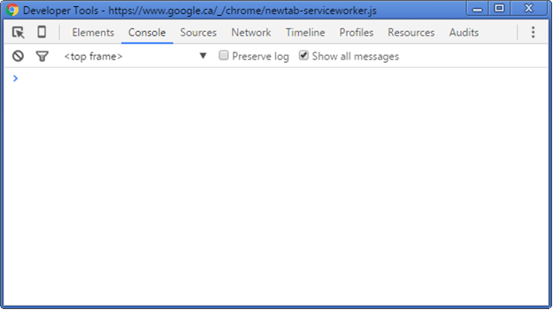
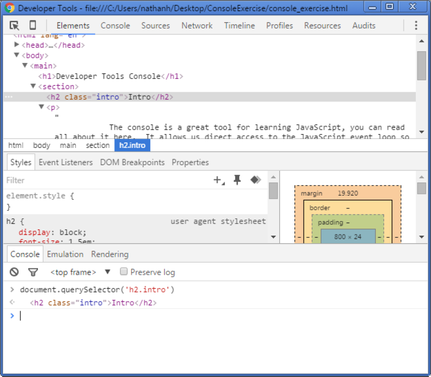
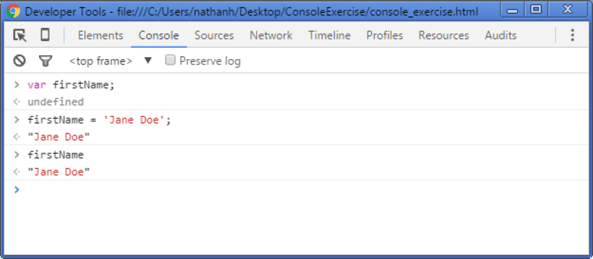
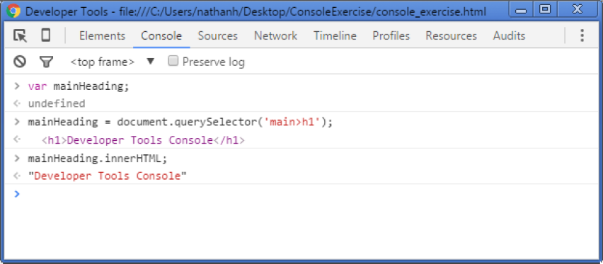
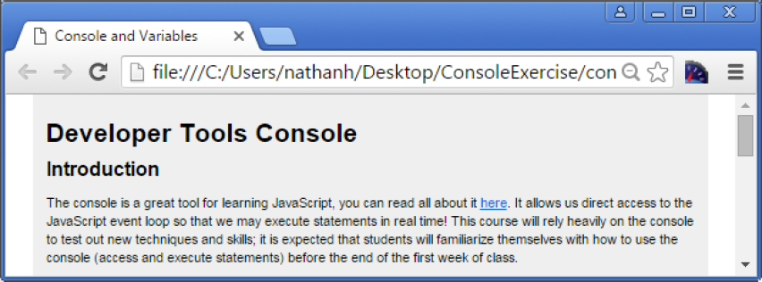

# Developer Tools Console 

## Intro

The console is a great tool for learning JavaScript, you can read all about it [here](https://developer.chrome.com/devtools/docs/console). It allows us direct access to the JavaScript event loop so that we may execute statements in real time! This course will rely heavily on the console to test out new techniques and skills; it is expected that students will familiarize themselves with how to use the console (access and execute statements) before the end of the first week of class.

There are several ways to access the console:

-   Right-click on an element in the page and select developer tools from the context menu
-   Press *[F12]* or *ctrl+shift+j* (Windows) or *cmd+option+j* (Mac)
-   From the customize menu, select *More tools* and then *Developer tools*

> Fig1. Chome Developer Tools Console
>
> 

### Exercise Steps

> The demos and practice exercises in this folder assume that you are using [Visual Studio Code] and have the [Live Server] extension installed.

1. Locate the HTML document ([console_exercise.html](./practice/console_exercise.html)) in the *practice/* folder.
1. Right-click on the file and choose "Open with Live Server".

    

1. Open the console using any of the aforementioned methods.
1. Keep the browser open for the remaining steps.

## Selecting Elements

In the browser, the **document** object reference provides several methods for selecting elements in the
DOM:

- `document.getElementById(selector)` – returns a single matched element
- `document.getElementsByTagName(selector)` – returns a list of matched elements
- `document.getElementsByClassName(selector)` – returns a list of matched elements
- `document.querySelector(selector)` – returns the first matched element
- `document.querySelectorAll(selector)` – returns a list of matched elements

In this exercise we will only be looking at **getElementById** and **querySelector** (the other methods will be
explored later). Each of these functions returns the matched element (if any) from the DOM.

### Exercise Steps

> Figure 2. Example selecting h2.intro
>
> 

1. Using either of the boldface functions above, select the following in the console:
    1. The main h1 heading
    1. The image with id *figure-img*
    1. The first paragraph (p) element
    1. The section h2 heading with class *intro*

## Variables

Often you will want to store a reference to these elements (and other needed values) so that you can
perform some work on or with them. Variables allow us to do just that.

We will use the reserved word **var** to declare any variables we will need. Simply put, a variable is made
up of two parts: an identifier (name) and a value. For example, to declare a variable to hold someone's
first name you might use the following statement:

```js
var firstName;
```

This only declares an identifier that we can reference, it currently has no associated value. To assign a value to the variable we use the '=' (assignment) operator. For example, to assign the string 'Jane Doe' to the firstName variable you would do the following:

```js
firstName = 'Jane Doe';
```

This will associate the identifier firstName with the value 'Jane Doe' [note: this is somewhat of a simplification and the deeper details will be covered later in the course]. Go ahead and try it in the
console.

### Exercise Steps

> Figure 3. Sample output from the above steps
>
> 

1. Type in the first statement to declare the firstName variable
1. Next, type in the assignment statement that will assign firstName a value
1. Now, whenever you type in the variable identifier firstName, you should see the associated value

## Modifying Elements

In the previous example, you assigned a simple string value to a variable, but we can assign anything in
JavaScript to a variable... including elements!


> Figure 4. Example reading the innerHTML of the main h1 element
>
> 

Elements in the DOM that may contain child content (i.e. parent elements) expose their child content through a property named **innerHTML**. This property can be read (accessed) or manipulated (replaced) through JavaScript. Once an element has been selected, you can access its innerHTML property through the '.' (dot) operator.

As an example, let's change the innerHTML for the h2.intro element to read *Introduction*.

### Exercise Steps

> Figure 5. Final output of previous exercise steps
>
> 

1. Declare a variable identifier to reference the h2.intro element, name the variable **intro**
1. Combine what you know about the assignment operator and selecting elements to assign the element to the variable
1. Once assigned, use the variable name followed by the '.' operator to access the innerHTML property
1. Just as you can 'get' the innerHTML from the element (see Figure 4) you can also 'set' the value as well by using the assignment operator and the new string value; in this case, "Introduction"
