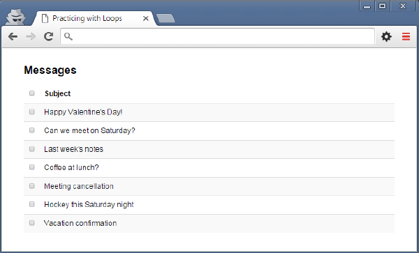
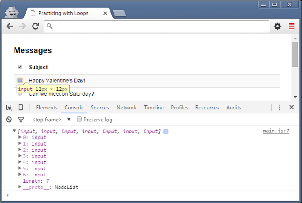

# Working with Loops and NodeLists

## Working with Multiple Elements

So far, we have only been focused on accessing a single element at a time, but there are times when access to multiple elements (perhaps even an unknown number) is required. For these cases, we can use loops to iterate over the collection of elements in question.

To illustrate the value of loops, we will complete a simple exercise, which will allow the user to toggle all checkboxes on a page:

> Figure 1. Exercise user interface



As you can see, it is a simple interface displaying message subject lines and checkboxes. What we will do in this walkthrough is add the functionality for toggling all checkboxes below the first one whenever it is checked/unchecked.

To begin, we need to add an event listener for checking the box. The first checkbox has a unique name that we can use as its selector and the event we want to listen for is the **change** event.

> Example 1. Adding an event listener for the toggle checkbox

```js
documet.querySelector('[name=toggle]').addEventListener('change', function (evt){
  console.log('toggle changed...');
));
```

Test that you have your event listener properly added and that checking/unchecking the first checkbox displays the output in the console.

## Selecting Checkboxes

What needs to happen when we check the toggle checkbox is really straightforward: we need to make sure that each message checkbox is also checked or unchecked. The first thing to do is to get access to all the message checkboxes in the document. The name attribute of some form elements (e.g. checkboxes and radio buttons) is used to group related elements together. This means that all checkboxes with the same shared name value can be selected via this attribute, but we cannot use document.querySelector as it only returns the first matched element.


### document.querySelectorAll

For this task we can use the very similar document.querySelectorAll function. Unlike its familiar variation, this function will return a node list of results (very similar to an array in almost every respect). This list can then be iterated over (much like an array) and we can inspect each element in it (in our case each element will be a checkbox).

> Example 2. Selecting all elements that match the selector and logging the resultant node list

```js
document.querySelector('[name=toggle]').addEventListener('change', function (evt){
  var checks = document.querySelectorAll('[name=message]');
  console.log(checks);
));
```

You should now see a list of all the checkbox elements in the console when the toggle is changed:

> Figure 2. Logging all checkboxes



Notice how all the input elements are contained between brackets with commas separating them. The first input in the list is active and you can see the highlighted checkbox it corresponds with in the table above it.

### Iterating Over the List

Selecting the list of checkboxes is one thing, iterating over them is another. Using what you have learned from the reading and previous in-class examples, creating a simple counter-controlled loop to go through the list is also quite straight-forward. This could be done using any one of the three types of loop discussed in class (while, do-while, for), but for this example we will use a while loop:

> Example 3. Iterating over the node list

```js
document.querySelector('[name=toggle]').addEventListener('change', function (evt){
  var checks = document.querySelectorAll('[name=message]');
  var idx = 0;
  while (idx < checks.length) {
    if (evt.target.checked) {
      checks[idx].checked = true;
    } else {
      checks[idx].checked = false;
    }
    idx = idx + 1;
  }
));
```

### Example Explained

The `idx` variable has been declared to track the current index of the element we want to inspect in the list. The first index in any list is 0, so that is where our index will begin.

The while condition is dependent on how many elements are in the list, so as long as the current index variable (idx) is less than the number of elements in the list (checks.length) we know there is at least one more element to look at.

The body of the loop is a simple test (if/else) for whether the toggle checkbox has been checked or not. The `checked` property of any checkbox input element can be read or set (true or false) depending on your needs. In this case, we are reading the current value of the toggle checkbox's checked property and setting the checked property of the message checkbox we are currently accessing in the list accordingly.

Lastly, the index variable must be incremented in order to ensure that a) we look at all elements in the list and that b) we don't find ourselves in an endless loop.

You should be able to toggle all checkboxes on the page now that you're done.

----


## Supplement

To give you a challenge, update the HTML of this exercise with a search form. *(You will also need to add any additional CSS classes/styling to make it look it good.)* The form should include the following:

- Input type of text
- Submit button

This search form should allow the user to search for and highlight matches in the subject lines of the displayed messages (partial matches included). The following image shows an example of a search:

> Figure 1. Complete solution demonstrating search feature


Be sure to take some time to really think about this one before you being coding; remember it's not about quantity but quality.
